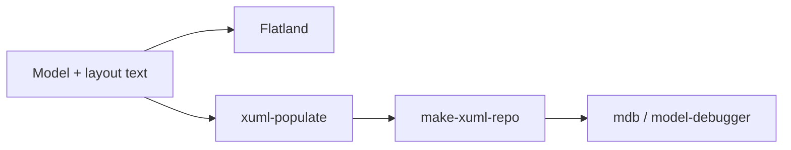

# Blueprint ecosystem overview

Blueprint is not a single application — it is a family of cooperating tools for
building, populating, diagramming, and executing Shlaer-Mellor Executable UML
(xUML) models. This page explains what each tool does and how they hand work off
to one another. Each tool has its own page under [`tools/`](tools/).

> **Status:** scaffold. The one-line roles below are seeded from each project's
> own repository description. Expand each section as you write.

## How the tools fit together

<!-- TODO: replace this list with a real pipeline diagram once the flow is settled.
     A Mermaid diagram renders natively on GitHub, e.g.:

-->

At a high level:

1. **Author** a model as text (plus a separate layout description).
2. **[Flatland](tools/flatland.md)** turns the model + layout text into a diagram.
3. **[xuml-populate](tools/xuml-populate.md)** populates the modeled system into
   the xUML metamodel repository.
4. **[make-xuml-repo](tools/make-xuml-repo.md)** builds the model repository
   database from the Shlaer-Mellor xUML metamodel.
5. **[mx](tools/mx.md)** — _(describe where mx sits in the flow)_.
6. **[mdb](tools/mdb.md)** debugs the model, independent of modeling language.

## Tool index

- [Flatland](tools/flatland.md)
- [xuml-populate](tools/xuml-populate.md)
- [make-xuml-repo](tools/make-xuml-repo.md)
- [mx](tools/mx.md)
- [mdb](tools/mdb.md)

## Related background

- [Shlaer-Mellor metamodel](https://github.com/modelint/shlaer-mellor-metamodel)
- [Scrall action language](https://github.com/modelint/scrall)
- [PyRAL](https://github.com/modelint/PyRAL) — relational algebra layer over TclRAL